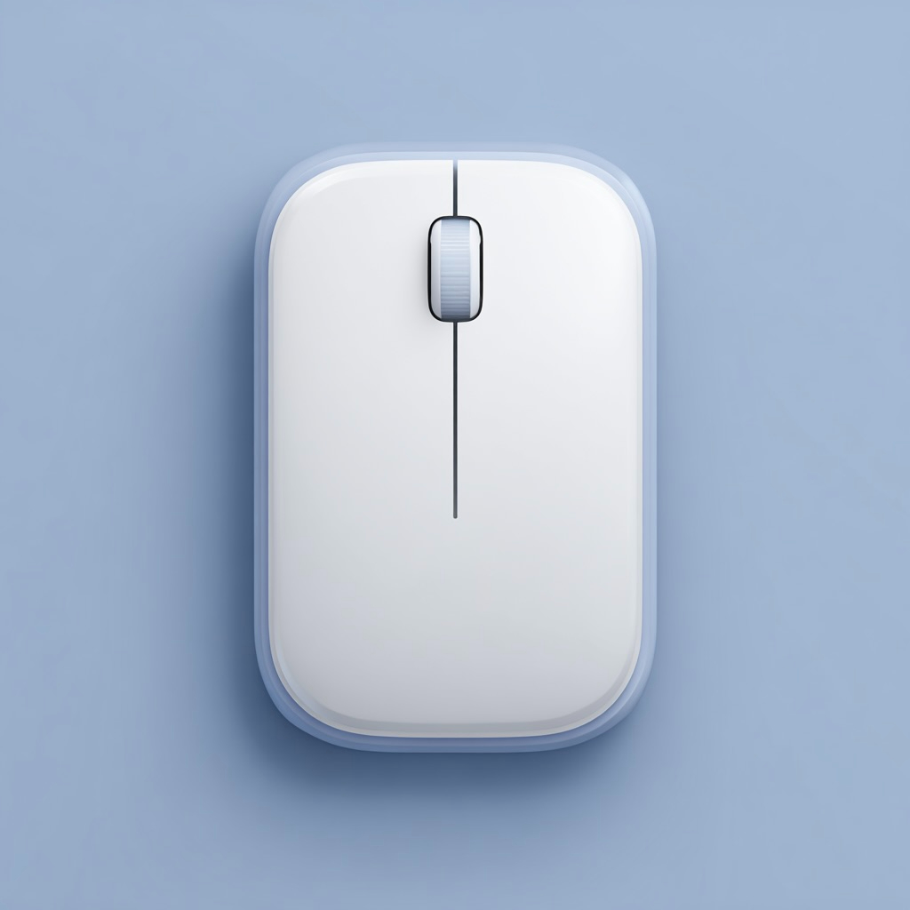
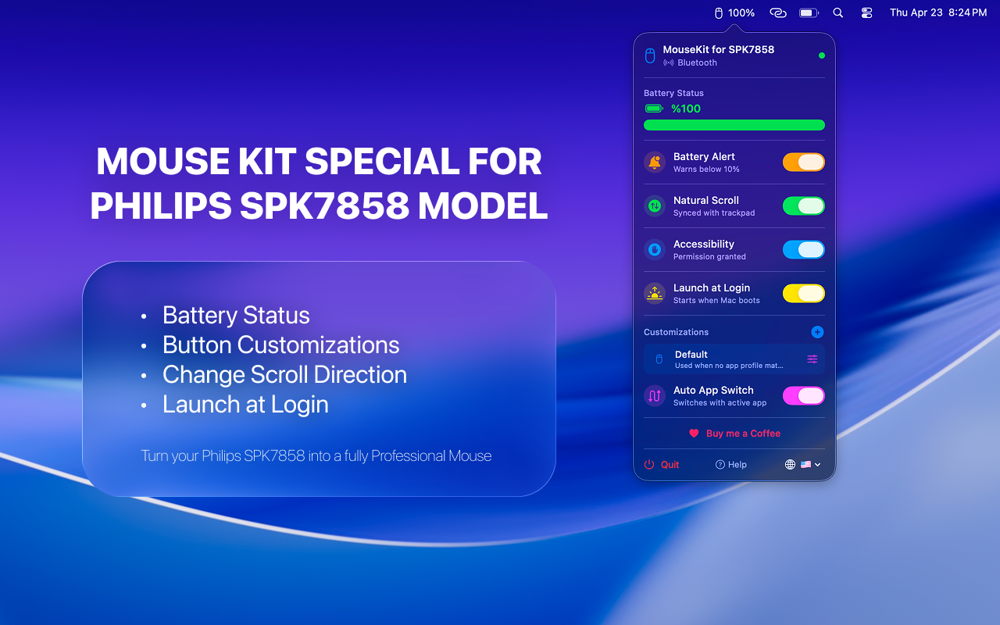
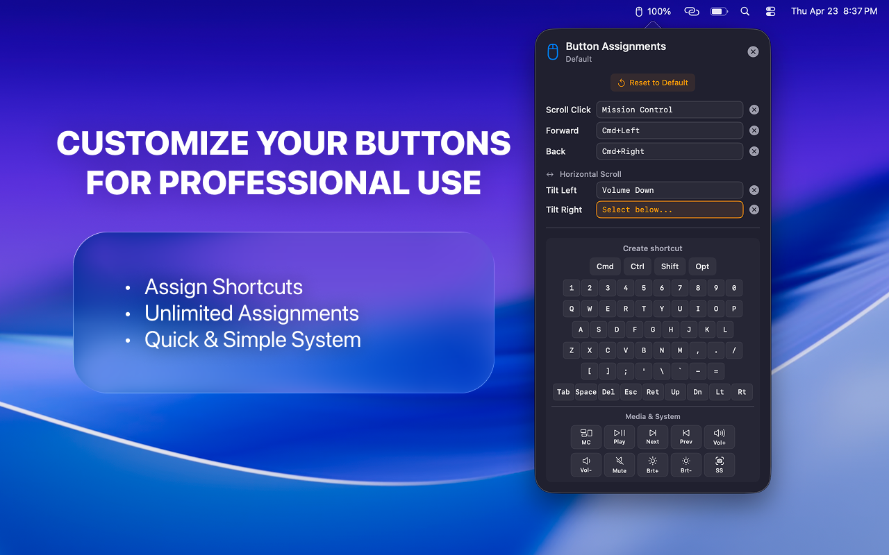
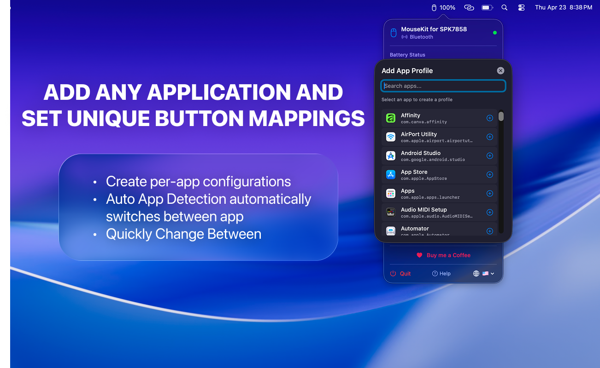
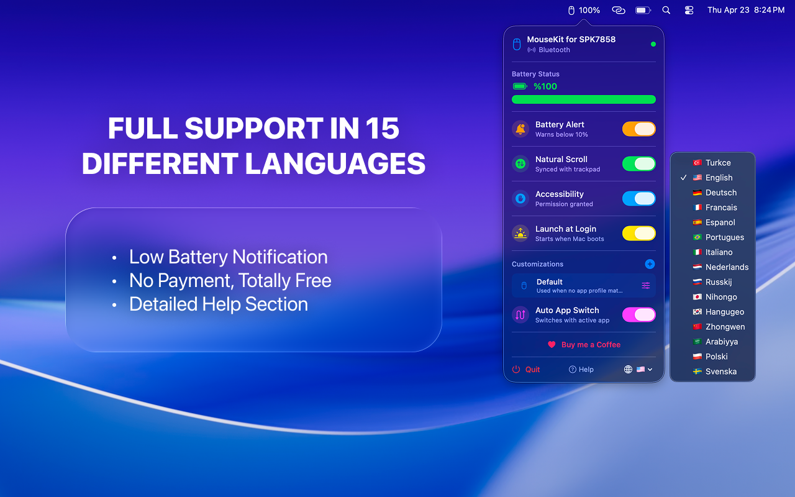

  

<h1 align="center">MouseKit for Philips SPK7858</h1>

  <strong>The ultimate macOS companion app for your Philips SPK7858 wireless mouse.</strong> 
  Unlock the full potential of your mouse with button remapping, battery monitoring, scroll reversal, and more.

  
  

  
  
  

---

## Why MouseKit?

The Philips SPK7858 is a great wireless mouse — but on macOS, the extra buttons (back, forward, scroll click) do nothing out of the box. There's no official Philips driver for Mac, and generic tools don't recognize this model.

**MouseKit** fixes that. It's a lightweight menu bar app built from scratch specifically for the SPK7858, giving you full control over every button.

---

## Screenshots

  
  &nbsp;&nbsp;&nbsp;
  
  &nbsp;&nbsp;&nbsp;
  
  &nbsp;&nbsp;&nbsp;
  

  Main panel &bull; Button remapping &bull; Virtual keyboard for custom shortcuts

---

## Features

### Button Remapping
- Remap **Middle Click**, **Forward**, **Back**, **Left Scroll**, **Right Scroll** buttons to any action
- Assign system actions: Mission Control, Screenshot, Copy, Paste, Volume, Brightness, Media Controls
- Create **custom keyboard shortcuts** with a built-in virtual keyboard (any key + Cmd/Ctrl/Shift/Opt modifiers)
- **Auto App Detection** — automatically switches button profiles based on the active application

### Battery Monitoring
- Real-time battery level displayed in the menu bar popover
- Automatic **BLE** — works with your mouse is connected via Bluetooth
- **Low battery notifications** — get alerted before your mouse dies

### Scroll Reversal (Natural Scroll)
- Enable **Natural Scroll** for your mouse independently from trackpad settings
- macOS applies natural scroll globally — MouseKit lets you reverse it for the mouse only

### Additional Features
- **Launch at Login** — start automatically when you boot your Mac
- **Auto App Detection** — profiles can switch automatically when you change apps
- **15 languages** supported: English, Turkish, German, French, Spanish, Portuguese, Italian, Dutch, Russian, Japanese, Korean, Chinese, Arabic, Polish, Swedish
- **Lightweight menu bar app** — no dock icon, no clutter, always accessible
- **Help section** with quick links to User Guide, Support, Privacy Policy, and Terms of Use
- **Smart permission handling** — detects Accessibility permission on first launch and activates button remapping instantly without requiring a restart
- **Privacy-first** — no data collection, no analytics, no internet connection required

---

## Supported Hardware

| Mouse | Connection | Status |
|-------|-----------|--------|
| Philips SPK7858 | Bluetooth LE | Fully Supported |

---

## System Requirements

- **macOS 13.0** (Ventura) or later
- **Accessibility permission** required for button remapping and scroll reversal
- **Bluetooth permission** required for battery monitoring via BLE

---

## Installation

1. Go to the **[Releases](../../releases/latest)** page
2. Download the latest `MouseKit-for-Philips-SPK7858.dmg`
3. Open the `.dmg` file
4. Drag **MouseKit** to your **Applications** folder
5. Launch the app — it appears in your **menu bar** (top-right corner)
6. Grant **Accessibility** and **Bluetooth** permissions when prompted
7. Start customizing your mouse buttons!

> **Note:** On first launch, macOS may show a security warning since the app is distributed outside the App Store. Right-click the app → Open → Open to bypass Gatekeeper.

---

## How It Works

MouseKit runs as a **menu bar app** and communicates with your Philips SPK7858 through:

- **IOKit HID** — intercepts mouse button events at the system level
- **CoreBluetooth** — connects to the mouse via BLE for battery level reading
- **CGEventTap** — remaps button presses to keyboard shortcuts and system actions
- **IOHIDManager** — detects mouse connection/disconnection events

All processing happens **locally on your Mac**. No data is sent anywhere.

---

## Frequently Asked Questions

<strong>Why does the app need Accessibility permission?</strong>

 
MouseKit uses macOS Accessibility APIs to intercept mouse button events and remap them to keyboard shortcuts or system actions. This is the only way to capture extra mouse button presses on macOS. The permission is used solely for input remapping — no screen content is read or recorded.

<strong>Why does the app need Bluetooth permission?</strong>

 
When your SPK7858 is connected via Bluetooth LE, MouseKit reads the battery level directly from the mouse's BLE GATT service. This requires Bluetooth permission. If you use the USB receiver only, Bluetooth permission is optional.

<strong>Does button remapping work with the USB receiver?</strong>

 
Yes! Button remapping works regardless of connection method (Bluetooth or USB receiver). The remapping is done at the system event level, not at the Bluetooth protocol level.

<strong>Can I use different button configurations for different apps?</strong>

 
MouseKit supports 3 switchable profiles that you can toggle between instantly. While it doesn't auto-switch per app, you can quickly swap profiles from the menu bar popover.

<strong>Is the app safe? Why does macOS show a warning?</strong>

 
MouseKit is signed with an Apple Developer ID certificate and notarized by Apple. The Gatekeeper warning appears because the app is distributed outside the Mac App Store. You can safely open it by right-clicking → Open.

---

## Privacy & Legal

- [Privacy Policy](https://foaltycoder.com/mousekitforphilips/privacy.html)
- [Terms of Use](https://foaltycoder.com/mousekitforphilips/terms.html)

MouseKit collects **zero user data**. No analytics, no telemetry, no network requests. Everything runs locally on your device.

---

## Support

Having issues or have a feature request?

- [Support Page](https://foaltycoder.com/support.html)
- [User Guide](https://foaltycoder.com/mousekitforphilips.html)
- [Open an Issue](../../issues) on this repository

---

## Support the Project

MouseKit is **free and open to download**. If it saved you from frustration with your Philips mouse on Mac, consider sponsoring the project to support future development:

  

Your support helps keep the app maintained, updated, and free for everyone.

---

  Made with care for Philips SPK7858 users on macOS. 
  &copy; 2026 FoaltyCoder. All rights reserved.

